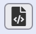

# EXcite Citation Identification and Segmentation 

With this app, you can manually or automatically identify and segment citations
in text extracted from a PDF. The citation data can then be exported to
[Zotero](https://zotero.org) and/or can be used to train the EXcite reference
extraction model to better recognize a particular citation style.

For information on installing the application, see [here](../README.md).

## Reference identification 

The first step is to identify the references within the text. Load a text to
mark up. Using the "Load" button, you can load a PDF, a previously processed
file containing identification markup (.csv), or a textfile (.txt) containing
OCR data. You can also load a PDF using the "Load from Zotero" button in the
dropdown of the "Load button". This will load the PDF attachment of the
currently selected item in Zotero.

Extract text and references using the "Identification" button. If your model is
good, you can choose the "Extract references from PDF" option. This will try to
automatically identify the references in the PDF document. In case the model does
not yet recognize the references correctly, choose "Extract text from PDF" and do
the mark up manually.

Mark up the text or correct the automatically produced markup as follows: After
selecting the parts of the text that contains citation/reference data, a menu
popup is shown with the available options. Long-clicking on a marked up section
of a text will select it.

For details on how to mark up the citation correctly, see the [information on
training the reference extraction
model](https://exparser.readthedocs.io/en/latest/ReferenceExtraction/). To see
the resulting markup, click on the  button.

After you have finished identifying the references, save the training document
to the backend. You can also download it to your computer using the "Export"
button.

## Reference segmentation

After you have identified the reference data, the second step is to segment it
into its individual components. 

Switch to segmentation mode by clicking the "Segmentation" button. You can also
load an XML file with segmented references to continue working on it.

Select the individual components of the citation data (author's surname and
given names, title, source, etc) and click on the corresponding label in the
popup menu (For details, see the [information on training the reference parsing
model](https://exparser.readthedocs.io/en/latest/ReferenceParsing/)). To see the
resulting markup, click on the  button.

Alternatively, if your model is already good enough, click on the
"Auto-Segmentation" option from the "Segmentation" dropdown to automatically
segment the references.

When you are finished, click on "Save" or "Export" to save your changes to the
training backend or to your computer. You can also export the citation data to
Zotero using the "Export to Zotero" button in the dropdown menu.